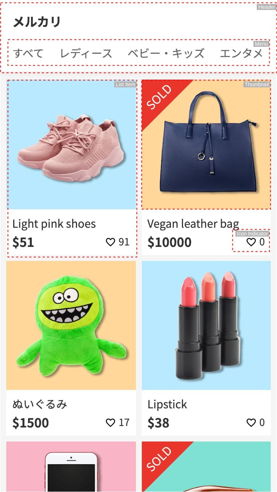
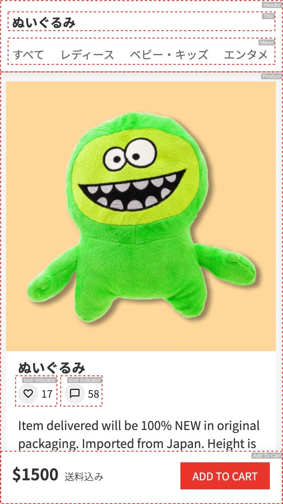
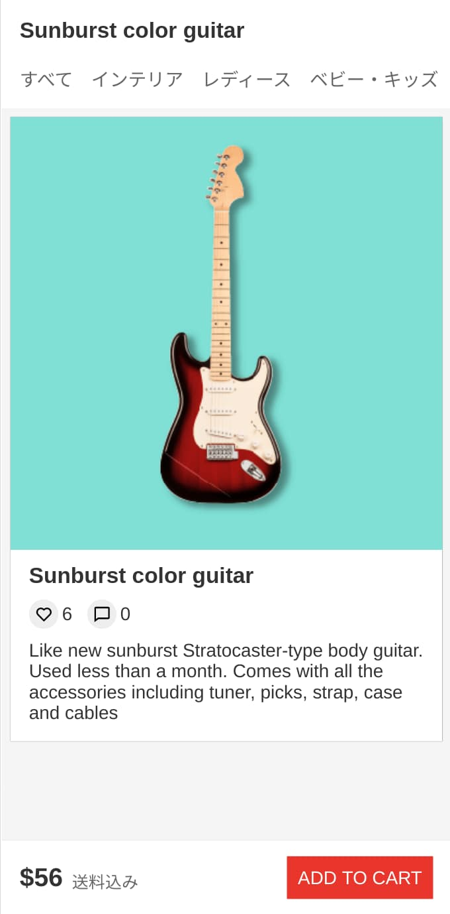

## Storefront Demo App

This mono-repository contains the system setup for a demo storefront.

### Architecture

Here is an overview of the architecture

---

### Structure

This repository is broken into two packages. They are:

#### API Server

The backend for the system. See documentation [here](./api-server/README.md)

#### Client

The web app client. See documentation [here](./client/README.md)

---

### Deployment

The system utilises docker-compose to allow for easy deployment across environments. To get started please follow these steps:

1. Install Docker Compose (setup [here](https://docs.docker.com/compose/install/))
2. Navigate to the root folder of this repository
3. Run `docker-compose up -d` (prefixing `sudo` may be required)
4. Wait for docker to pull the necessary images, build the projects and start everything up
5. Navigate to [http://localhost/]([http://localhost/])

Tested using Docker Compose v1.24.1 and Docker v19.03.8. If you have any difficulties with setup please open an issue in this repository

---

### Assumptions

The following assumptions were made when creating this project

- Categories are changed infrequently

  > The web app stores categories in memory over the entirety of a session for speed considerations. This assumes that they will not change frequently.

- Products change frequently/listings are updated in real-time

  > Lists are not cached as it is assumed in a real life application products would be updating and also search queries could be tailored to each user for increased conversion rates.

- There are no requirements to support legacy browsers

  > The web app is built using modern CSS functionality such as CSS Grid and Flexbox, therefore may not render correctly on legacy, non-evergreen browsers.

- The number of users is small

  > This assumption invalidates the necessity of a load-balancer in the system architecture in addition to adding horizontal scalability through kubernetes, sharding etc.

---

### Frameworks

The following frameworks are used:

- [Typescript](https://www.typescriptlang.org/)
- [React](https://reactjs.org/)
- [Parcel.js](https://parceljs.org/) - Bundler
- [Styled components](https://styled-components.com/)
- [i18next](https://www.i18next.com/)
- [Jest](https://jestjs.io/)
- [Testing Library](https://testing-library.com/)
- [Docker](https://www.docker.com/)
- [Nginx](https://www.nginx.com/)

---

### Components Overview

The pages are split into the following component modules

#### Item List Page

#### Item Page

---

### Screenshots

- Responsive

#### Item List Page

#### Item page

